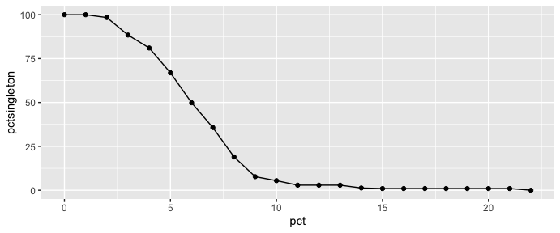
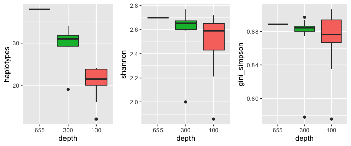
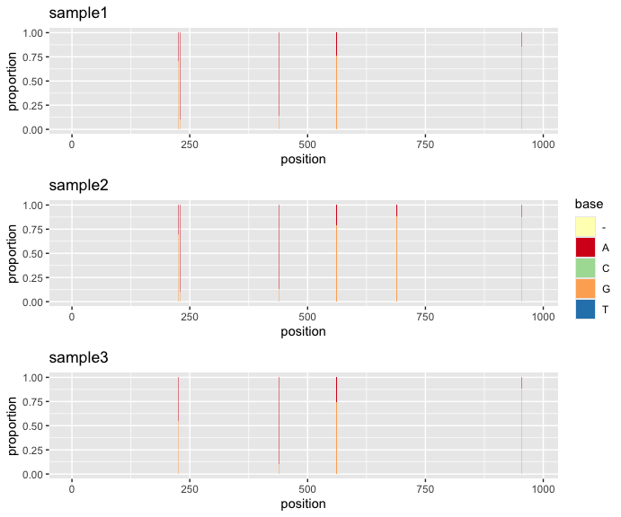
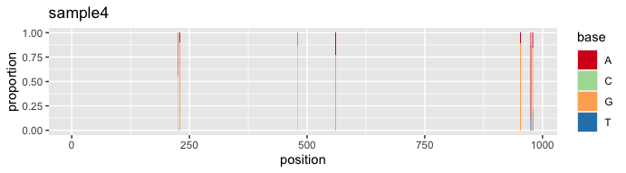
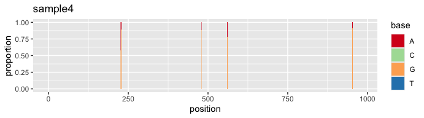
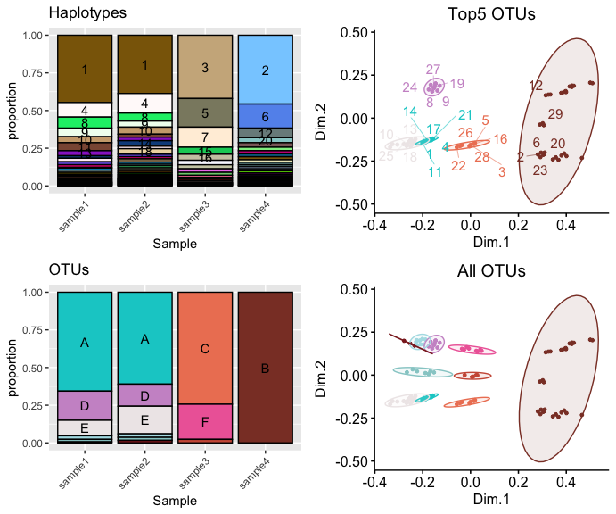

# longreadvqs 

<!-- badges: start -->

[](https://www.gnu.org/licenses/gpl-3.0.en.html)
[](https://cran.r-project.org/package=longreadvqs)
[](https://github.com/NakarinP/longreadvqs)
[](https://cran.r-project.org/package=longreadvqs)


Toolkit for Viral Quasispecies Comparison from Long-Read Sequencing performing variety of viral quasispecies diversity analyses based on long-read sequence alignment. Main functions include 1) sequencing error/noise minimization and read sampling, 2) Single nucleotide variant (SNV) profiles comparison, and 3) viral quasispecies profiles comparison and visualization. 

## Installation

'longreadvqs' is a package available on CRAN and can be installed easily in R:
```{r, eval=FALSE}
install.packages("longreadvqs")
```

If you have a problem installing [```QSutils```](https://github.com/VHIRHepatiques/QSutils), a key dependency of this package, please do the following:

```{r, message=FALSE, warning=FALSE, results = "hide", eval=FALSE}
install.packages("devtools")
library(devtools)
install_git("https://github.com/VHIRHepatiques/QSutils")
```

## Background

**Viral quasispecies (VQS)** refers to a genetically closely related
population of viral variants. Measurement of VQS diversity, especially
in highly mutating RNA viruses, is vital for understanding their
micro-evolution. **Long-read sequencing** facilitates retrieving
full-length sequences of specific genes or genomes from each variant,
yet challenges like sequencing errors and low coverage depth hinder
diversity metric computation and comparison. Here, we present
methodologies to overcome these challenges, enabling comparisons of VQS
diversity.

## Individual sample preparation

### Sequencing error/noise minimization and down-sampling

Sequencing errors create plenty of artificial single nucleotide variants
(SNVs), leading to an overestimated number of singleton haplotypes
(haplotype = group of identical reads, singleton haplotype = haplotype
with only a single read). Our package aims to minimize potential
sequencing errors and potential noises from rare mutations along long 
reads defined as SNV(s) or nucleotide base(s) with a frequency less than 
n % at each nucleotide position. Such problematic base(s) will be replaced 
with the consensus or majority base of that particular position.

First, load the “longreadvqs” package and a FASTA file of example read
alignment (sample1.fasta). To choose the % cut-off for noise
minimization, use the “pctopt” function that shows % singleton
haplotypes in the read alignment across different % cut-offs. Then, use
the “vqssub” function for noise minimization, in this case, we choose a
10% cut-off that decreases singleton haplotypes to less than 10% of all
reads. This function will give a summary of VQS diversity metrics
calculated by the “QSutils” package ([Gregori, et al.,
2016](https://doi.org/10.1016/j.virol.2016.03.017)) after noise
minimization.

``` r
library(longreadvqs)

#Load sample 1.
sample1 <- system.file("extdata", "sample1.fasta", package = "longreadvqs")
```

``` r
#Check which % cut-off could effectively minimize noises by assessing % singleton haplotypes.
library(ggplot2)

x <- pctopt(sample1, pctsing = 0, label = "sample1")
ggplot(x, aes(x=pct, y=pctsingleton)) + geom_line() + geom_point()
```



``` r
#VQS diversity metrics of noise minimized (10% cut-off) read alignment
vqssub(sample1, pct = 10, label = "sample1")
#>     label  method samplingwhen pct fulldepth depth haplotypes nsingleton
#> 1 sample1 conbase        after  10       311   311         47         17
#>   pctsingleton polymorph mutations  shannon norm_shannon gini_simpson      FAD
#> 1     5.466238         6       116 2.917347    0.7577235    0.8819625 6.475025
#>           Mfe         Pie         Mfm         Pim
#> 1 0.002580953 0.002994924 6.79165e-09 0.001803544
```

To compare VQS diversity across samples, it’s important to standardize
the read alignment depth. Since sequencing results can vary, we perform
down-sampling after minimizing noises with the “vqssub” function. In our
case, for sample1, sample2, and sample3 with original depths of 311,
316, and 655, respectively, we randomly down-sample them to a common
depth of 300.

``` r
#Load samples 2 and 3.
sample2 <- system.file("extdata", "sample2.fasta", package = "longreadvqs")
sample3 <- system.file("extdata", "sample3.fasta", package = "longreadvqs")

#Noise minimization (10% cut-off) and down-sampling (depth of 300)
a <- vqssub(sample1, pct = 10, samsize = 300, label = "sample1")
b <- vqssub(sample2, pct = 10, samsize = 300, label = "sample2")
c <- vqssub(sample3, pct = 10, samsize = 300, label = "sample3")

#Compare VQS diversity across three samples after noise minimization and down-sampling.
rbind(a, b, c)
#>     label  method samplingwhen pct fulldepth depth haplotypes nsingleton
#> 1 sample1 conbase        after  10       311   300         44         16
#> 2 sample2 conbase        after  10       316   300         56         24
#> 3 sample3 conbase        after  10       655   300         28          4
#>   pctsingleton polymorph mutations  shannon norm_shannon gini_simpson      FAD
#> 1     5.333333         6       108 2.875905    0.7599792    0.8799554 5.626911
#> 2     8.000000         7       135 3.126571    0.7767200    0.8977035 9.861366
#> 3     1.333333         5        53 2.670116    0.8013062    0.8943813 1.845056
#>           Mfe         Pie          Mfm         Pim
#> 1 0.002548420 0.002974055 7.016045e-09 0.001782496
#> 2 0.002457405 0.003201742 6.025138e-09 0.001891865
#> 3 0.002147954 0.002440550 5.532911e-09 0.001636262
```

We can also repeatedly down-sample the alignments and check the
consistency of each VQS diversity metric at the different depths like
the following example.

``` r
#Randomly down-sample from depth of 655 to 300, and 100 (10 iterations for each sample size).
set.seed(123)
c_full <- vqssub(sample3, pct = 10, label = "full_depth") #non-sampled alignment
c_300 <- vqsresub(sample3, iter = 10, pct = 10, 
                  samsize = 300, label = "depth_300") #down-sample to depth of 300
c_100 <- vqsresub(sample3, iter = 10, pct = 10,
                  samsize = 100, label = "depth_100") #down-sample to depth of 100

all_c <- rbind(c_full, c_300, c_100) #combine data

#Load packages for visualization.
library(cowplot)

all_c$depth <- as.character(all_c$depth)
depthorder <- c("655", "300", "100")

#Plot box-plots of three VQS metrics variation through different sampling depths.
haplotypes <- ggplot(all_c, aes(x = factor(depth, level=depthorder), y = haplotypes, 
    group = interaction(depth, label), fill = label)) + geom_boxplot() + 
  xlab("depth") + theme(legend.position = "none")
shannon <- ggplot(all_c, aes(x = factor(depth, level=depthorder), y = shannon, 
    group = interaction(depth, label), fill = label)) + geom_boxplot() + 
  xlab("depth") + theme(legend.position = "none")
gini_simpson <- ggplot(all_c, aes(x = factor(depth, level=depthorder), y = gini_simpson, 
    group = interaction(depth, label), fill = label)) + geom_boxplot() + 
  xlab("depth") + theme(legend.position = "none")
```

``` r
plot_grid(haplotypes, shannon, gini_simpson, nrow = 1)
```



From this plot, the number of haplotypes obviously decreases as the
depth decreases, while Shannon entropy and the Gini-Simpson index remain
relatively stable with high variation at a depth of 100.

### VQS data preparation for in-depth comparison

The previous “vqssub” function just summarizes key VQS diversity metrics
after noise minimization and down-sampling. However, these metrics do
not provide us with comprehensive data for further comparative analyses,
such as SNV positions and full read alignment after down-sampling. The
“vqsassess” function will generate a complete VQS profile for each
sample, and the outputs can be used for other functions.

In this example, we repeat noise minimization and down-sampling for
samples 1-3 but apply the “vqsassess” function instead of the “vqssub”
function. We then compare the SNV profiles between these samples using
the “snvcompare” function.

``` r
#Generate complete VQS data for further comparison for each sample.
s1 <- vqsassess(sample1, pct = 10, samsize = 300, label = "sample1")
s2 <- vqsassess(sample2, pct = 10, samsize = 300, label = "sample2")
s3 <- vqsassess(sample3, pct = 10, samsize = 300, label = "sample3")
```

``` r
#Compare SNV profile between three samples.
snvcompare(samplelist = list(s1, s2, s3), ncol = 1)
```



This plot shows that SNV positions are well-aligned between three
samples. In some cases, SNV plot can highlight sequencing error
concentrating at a particular range in read alignment like the
additional sample added to the following example.

``` r
#Load sample 4.
sample4 <- system.file("extdata", "mock.fasta", package = "longreadvqs")
s4 <- vqsassess(sample4, pct = 10, samsize = 300, label = "sample4")
```

``` r
#SNV profile of sample 4
s4$snv
```



The plot above captures atypical SNVs towards the 3’ end of the sample 4
alignment, which is potentially caused by sequencing error. We can
address this issue using the “vqscustompct” function, which allows us to
adjust the % cut-off for noise minimization at specific range(s) in the
alignment. In the case of sample 4, we increase the % cut-off from
position 972 onward, raising it from 10% to 30%.

``` r
#Use "vqscustompct" function to increase % cut-off after position 972 to 30%.
s4_fix <- vqscustompct(sample4, pct = 10, brkpos = c("1:971","972:982"), lspct = c(10,30), 
                       samsize = 300, label = "sample4")
```

``` r
#SNV profile of sample 4 after % cut-off adjustment
s4_fix$snv
```



## Comparing VQS diversity across multiple samples

Once we have all samples prepared, we can combine them to not only
compare within-sample diversity but also explore between-sample
relationships. Using the “vqscompare” function, noise-minimized
down-sampled reads from all samples are pooled to identify 1) identical
haplotypes and 2) genetically closely related haplotypes between
samples. In this example, we combine the previously prepared outputs of
samples 1 to 4 into the “vqscompare” function, allowing it to generate a
summary comparative plot.

``` r
#List outputs from "vqsassess" or "vqscustompct" that we want to compare into "vqscompare" function.
#Set the number of new OTU groups based on k-means clustering to 10 groups (kmeans.n = 10).
set.seed(1234)
comp <- vqscompare(samplelist = list(s1, s2, s3, s4_fix),
                   lab_name = "Sample", kmeans.n = 10)
```

``` r
#The most important output of the "vqscompare" function is the summary plot.
comp$summaryplot
```



The summary plot comprises four main subplots. First, the haplotype plot
at the top left displays all unique haplotypes and their proportions
across all samples. Second, the operational taxonomic unit (OTU) plot at
the bottom left groups genetically closely related haplotypes into new
OTUs through k-means clustering on a multidimensional scale (MDS) of all
samples’ pairwise SNV distances. Third, the MDS plot at the top right
visualizes the genetic relationships and clustering scheme of the five
largest OTUs and haplotypes belonging to each OTU. Fourth, the MDS plot
at the bottom right shows all classified OTUs.

In our example, samples 1 to 4 represent read alignments of the
influenza A virus (IAV)’s M segment, gathered from patients in the same
ward ([Williams, et al., 2023](https://doi.org/10.1099/mgen.0.001083)).
Based on our comparison, patients of samples 1 and 2 likely contracted
the same virus, as evidenced by the similarity in both VQS haplotype
profiles and OTU profiles. Meanwhile, patients of samples 3 and 4 appear
to have been infected with distinct sets of viruses, differing from each
other and from those in samples 1 and 2. Despite these distinctions, the
MDS plots indicate that the genetic distances between all samples are
not significantly far apart. This suggests that these diversities may
not be adequately captured at the consensus gene level.

## Citation

https://doi.org/10.21203/rs.3.rs-4637890/v1
